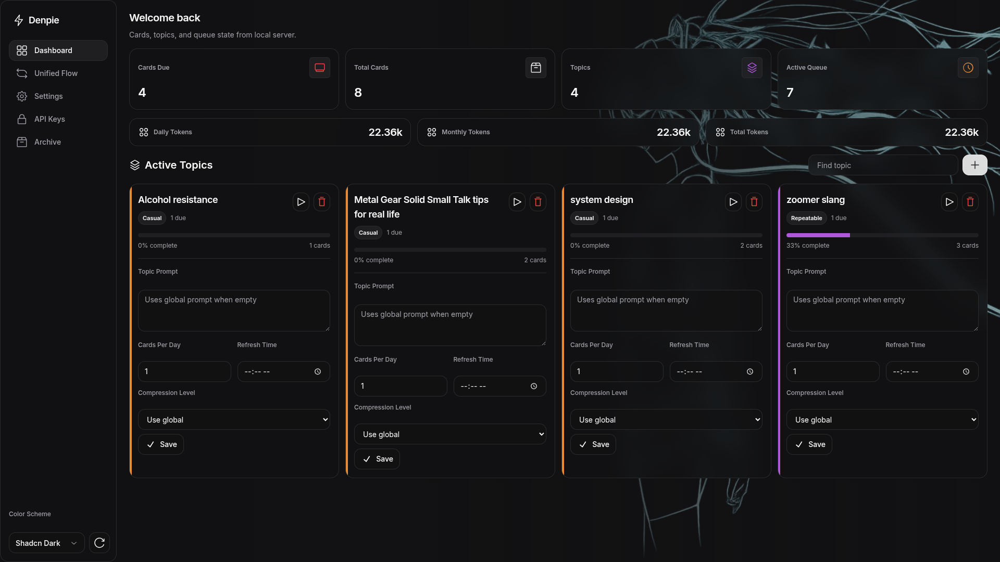
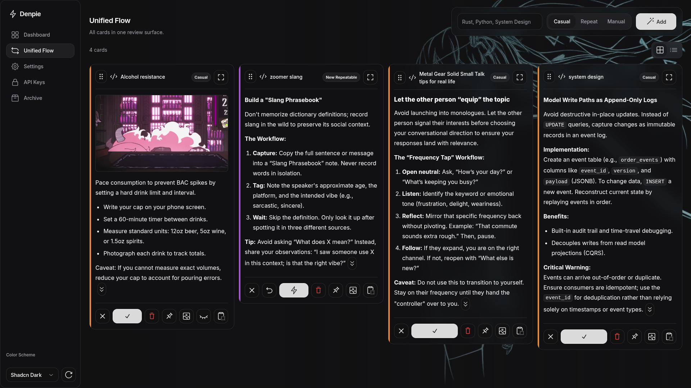
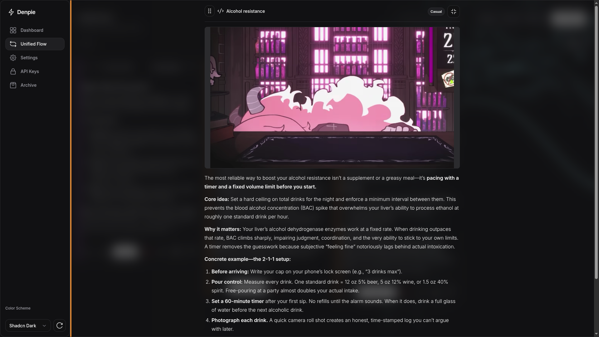

# Daily Tip Server

A Rust-based backend service that generates, serves, and schedules daily tip cards using a spaced repetition system (SM-2 / FSRS). LLM content generation is powered by any OpenAI-compatible API endpoint (Gemini, OpenRouter, etc.) via `async-openai`.

## Features

- **Spaced Repetition System (SRS)**: SM-2 and FSRS algorithms optimize tip delivery based on user review grades.
- **Casual Cards**: Queue-style tips can be dismissed or acknowledged so clients can pull the next card immediately; acknowledged cards are scheduled with SRS.
- **Repeatable Cards**: Re:word-style cards can be dismissed, repeated, memorized, or acknowledged; clients can advance after repeatable review actions, and repeated cards come back when due through SRS scheduling.
- **Topic Classes**: Topics belong to a card behavior class: casual, repeatable, or manual. SRS remains the scheduling algorithm, not a card class.
- **Daily Topic Cards**: Each topic/type returns a configurable number of stable SRS cards per local day, with per-topic overrides for count, time zone, and update time.
- **Pinned Tipcards**: Any active card can be pinned from the control panel or API so it stays visible in a separate top section until unpinned.
- **Custom Tipcards**: External workflows can submit grey `custom_tip` cards for summaries or reminders without adding SRS review state.
- **Active Card Limit**: A global max-active-cards setting can stop new card creation while still allowing due and pinned cards to be reviewed.
- **Any OpenAI-Compatible LLM**: Configure the API key, base URL, and model through the protobuf API — no hardcoded vendor lock-in.
- **Token Spend Counters**: The browser dashboard tracks OpenAI-compatible `usage.total_tokens` for daily, monthly, and lifetime LLM calls.
- **Unified Protobuf API**: `POST /api` manages tips, reviews, settings, keys, topics, topic deletion, card pinning, cards, and summary counts with one full-access API key.
- **Root Control Page**: `/` serves a browser control panel that talks to the same protobuf API, with stable per-card loading skeletons, compact/full card text controls, title-row fullscreen card viewing, and touch-friendly card reordering.
- **Single Dashboard Surface**: The browser dashboard is served only at `/`;
- **CSS-Only Motion**: The control page uses fast page-entry, card-entry, and compact-to-full tipcard animations with reduced-motion support.
- **Markdown Tipcards**: API responses keep the original raw markdown-capable text so clients can render it however they need.
- **Optional GitHub Autoupdate**: Disabled by default. The systemd install includes a root-owned updater timer; enabling it through the API polls GitHub, rebuilds from the configured repository branch, installs the new binary/schema, and restarts the service.
- **Bootstrap Admin Token**: On first startup the server generates and prints an admin token. Use it only with `bootstrap_api_key` to create a full-access API key.
- **Protobuf API**: The only public API is a single protobuf request/response envelope for both client and admin operations.
- **Single-User, Multi-Client**: One user's SRS state is shared across all clients (desktop widget, Telegram bot, etc.) via per-client API keys.
- **SQLite Database**: Lightweight persistence via `sqlx` with compile-time query validation.

## Screenshots

### Dashboard



### Unified Flow



### Fullscreen Card



## Tech Stack

| Layer | Technology |
|---|---|
| Language | Rust (edition 2021) |
| Web Framework | Axum |
| Database | SQLite (via SQLx) |
| Async Runtime | Tokio |
| LLM Client | `async-openai` |
| Serialization | Protocol Buffers (`prost`) |
| Frontend | Static HTML control panel at `/` |
| Public API | Protocol Buffers over HTTP |

## Project Structure

```
.
├── src/
│   ├── main.rs        # Router setup, state, app initialization
│   ├── api.rs         # Unified /api protobuf endpoint
│   ├── autoupdate.rs  # Optional in-process GitHub change watcher
│   ├── llm.rs         # LLM wrappers (generate_new_card, compress_card, generate_card_title)
│   └── srs.rs         # SM-2 and FSRS algorithm implementations
├── schema.sql         # SQLite table definitions (applied automatically on startup)
├── proto/
│   └── dailytip.proto # Protobuf schema for the unified API
├── templates/
│   └── app.html       # Root control page using /api
├── docs/              # API documentation
└── settings.yaml      # Runtime config, generated locally and ignored
```

## Getting Started

### Prerequisites

- Rust (latest stable)
- SQLite

### Setup

1. **Clone the repository.**

2. **Configure environment** (only needed for SQLx compile-time checks):
   ```bash
   cp .env.example .env
   ```
   The only required variable is `DATABASE_URL`. LLM credentials are **not** set via environment variables.

3. **Run the server:**
   ```bash
   cargo run
   ```
   The server starts on `http://127.0.0.1:3017` by default. On the first run it will:
   - Create `dailytip.db` and apply `schema.sql` automatically.
   - Generate and print a one-time admin token to the console.

4. **Open the root page** at `http://127.0.0.1:3017/`, or call `POST /api` directly. Use `bootstrap_api_key` with the printed `admin_token` to create the first `sk_live_*` full-access key.

5. **Configure your LLM** through `POST /api` with `update_settings`:
   - **LLM Model** — e.g. `google/gemini-2.5-pro` or `openai/gpt-4o`
   - **LLM API Key** — your provider API key
   - **LLM Base URL** — e.g. `https://openrouter.ai/api/v1` or `https://generativelanguage.googleapis.com/v1beta/openai`
   - **Prompt Template** — use `{topic}` as the placeholder; `{context}`, `{existing_cards}`, and `{dismissed_cards}` can place prior card titles explicitly

   Each topic can also define its own prompt, daily card count, time zone, and update time with `update_topic`. Topics can be deleted from the browser control panel or with `delete_topic`; deleting a topic also deletes its cards and review state. The browser control panel has a class switcher for Casual, Repeatable, and Manual cards; Manual cards are saved from user-entered text and do not call the LLM. In Manual mode, Tab or Enter moves from the title field straight to the card text; in the card text, Enter saves the card and Shift+Enter inserts a newline. External systems can use `submit_custom_tipcard` to store `custom_tip` cards for summaries and reminders; these cards return `topic_class = "custom"` and do not create SRS review state. Active cards can be pinned so they remain in a separate top section even before their next review time; unpinning returns them to normal scheduling. Set **Max Active Cards** to stop creating new cards once active review state reaches that number; `0` means unlimited, and existing due/pinned cards remain available. Empty topic prompts and time fields fall back to the global settings. When a new generated card is created, the server sends generated titles from existing and dismissed cards for the same topic/type so the model can avoid repeats.

6. **Use the API key** in `ApiRequest.auth` for every operation except `bootstrap_api_key`.

## Configuration (`settings.yaml`)

All runtime configuration lives in `settings.yaml` and is managed through the protobuf API. **Do not commit this file** — it contains your LLM API key and admin token.

| Key | Description | Default |
|---|---|---|
| `admin_token` | Bootstrap token for creating the first API key | Auto-generated on first run |
| `llm_model` | Model identifier string | `google/gemini-3.1-flash` |
| `llm_compress_model` | Model identifier string for compressed summaries and generated card titles | `google/gemini-3.1-flash-lite-preview` |
| `llm_reasoning_effort` | Reasoning effort for generated tips: `none`, `minimal`, `low`, `medium`, `high`, or `xhigh` | `none` |
| `llm_compress_reasoning_effort` | Reasoning effort for compressed summaries and generated titles; `none` disables compression/title thinking tokens | `none` |
| `prompt_template` | Tip generation prompt (`{topic}` placeholder) | `Give a smart tip about {topic}.` |
| `llm_api_key` | API key for the LLM provider | *(empty — set via API)* |
| `llm_base_url` | Base URL for the OpenAI-compatible API | `https://openrouter.ai/api/v1` |
| `llm_compress_base_url` | Base URL for compression requests; defaults to `llm_base_url` when missing | `https://openrouter.ai/api/v1` |
| `color_scheme` | Client color scheme preference for external clients. Browser themes include `default`, `ayu`, `solarized-light`, `solarized-dark`, `dracula`, `carbonfox`, `amoled`, and `slate`. | `default` |
| `daily_time_zone` | Default IANA time zone or fixed `UTC+n` offset used for daily topic-card windows | `UTC` |
| `daily_update_time` | Default local `HH:MM` time when each topic can receive new daily cards | `00:00` |
| `autoupdate_enabled` | Enable GitHub commit polling and command-based updates | `false` |
| `autoupdate_repo` | GitHub repository in `owner/repo` form, or a GitHub URL | `slopfire/dailytipdraft` |
| `autoupdate_branch` | Branch or ref checked through the GitHub commits API | `master` |
| `autoupdate_check_interval_secs` | Poll interval in seconds; values below 60 are clamped to 60 | `3600` |
| `autoupdate_command` | Optional local shell command for non-systemd installs after a new commit is detected | *(empty)* |
| `autoupdate_last_seen_sha` | Last GitHub commit SHA recorded by the updater | *(empty)* |

### GitHub Autoupdate

Autoupdate is intentionally off by default. For the systemd installation, the installer enables a `dailytipdraft-autoupdate.timer` that reads `settings.yaml`; checking **Enable GitHub autoupdate** in the app is enough. On the first successful check the updater records the current commit SHA as a baseline and does not update. On later checks, a changed SHA triggers a root-owned update helper that fetches the configured branch, runs `cargo build --release`, installs the new binary plus shared files, records the new SHA, and restarts `dailytipdraft.service`. The host must keep the build tools available after installation (`git`, `cargo` from the installer-managed rustup toolchain or another Rust installation, and `protoc`/`protobuf-compiler`).

The settings screen also has a **Check Now** button. It now shows staged progress while saving settings, checking GitHub, and, when a new commit is found, starting the update flow. If `autoupdate_command` is empty, it starts the default systemd updater service (`dailytipdraft-autoupdate.service`) with `systemctl start --no-block`; set `DAILYTIP_AUTOUPDATE_SERVICE` to use a different unit name. The installer also installs a narrow polkit rule allowing the `dailytipdraft` service user to start only that updater unit. If the unit or permission rule is missing, the check fails with a configuration message instead of a raw systemctl failure. For non-systemd or custom deployments it runs the configured `autoupdate_command` immediately after checking GitHub. When an update is found, the browser shows the target commit, polls `/admin/autoupdate/status` for real updater phases, and polls the server build SHA after restart, so it only reports completion when the deployed server changes. The updater records `autoupdate_last_seen_sha` only after a successful service restart, allowing failed restarts to be retried. You can also manually trigger the root-owned updater with:

```bash
sudo systemctl start dailytipdraft-autoupdate.service
```

Manual systemd starts bypass the saved check interval; the helper still exits without changes when the recorded SHA already matches the remote branch.

Default repository comes from this repo's `origin` remote: `slopfire/dailytipdraft`. You can override it with another `owner/repo`, `https://github.com/owner/repo`, or `git@github.com:owner/repo.git` value. Example:

```yaml
autoupdate_enabled: true
autoupdate_repo: slopfire/dailytipdraft
autoupdate_branch: master
autoupdate_check_interval_secs: 1800
```

For non-systemd or custom deployments, set `autoupdate_command` to a local command that performs the update. In that mode, scheduled checks and the **Check Now** button run the command with the same user, permissions, and working directory as the server process; if it succeeds, the server exits with code `75` so an external supervisor can restart it.

## Runtime Environment

The server can run from the project directory with defaults, or from an installed location with explicit paths.

| Variable | Description | Default |
|---|---|---|
| `DAILYTIP_BIND_ADDR` | Listen address and port | `127.0.0.1:3017` |
| `DAILYTIP_DATA_DIR` | Directory for `settings.yaml` and `dailytip.db` | current directory |
| `DAILYTIP_SCHEMA_PATH` | Path to `schema.sql` | `schema.sql` in the current directory |

Example:

```bash
DAILYTIP_BIND_ADDR=127.0.0.1:3017 \
DAILYTIP_DATA_DIR=/var/lib/dailytipdraft \
DAILYTIP_SCHEMA_PATH=/usr/local/share/dailytipdraft/schema.sql \
dailytipdraft
```

## Deployment

### systemd

Use the installer on a Linux host with systemd:

```bash
./install.sh
```

The installer installs Rust with rustup if `cargo` is not available, builds `target/release/dailytipdraft`, installs the binary to `/usr/local/bin/dailytipdraft`, installs `schema.sql` and the root page to `/usr/local/share/dailytipdraft`, creates a `dailytipdraft` system user, stores runtime data in `/var/lib/dailytipdraft`, and starts `dailytipdraft.service`. It uses `sudo` internally for system directories, service users, and systemd commands.
It also installs and enables `dailytipdraft-autoupdate.timer`, which stays idle unless `autoupdate_enabled: true` is set in `settings.yaml`.

Useful commands:

```bash
sudo systemctl status dailytipdraft
sudo journalctl -u dailytipdraft -f
sudo systemctl restart dailytipdraft
sudo systemctl status dailytipdraft-autoupdate.timer
sudo systemctl start dailytipdraft-autoupdate.service
./install.sh uninstall
```

Set a different loopback port during install when needed:

```bash
BIND_ADDR=127.0.0.1:3010 ./install.sh
```

The generated admin token is printed in the service logs on first startup:

```bash
sudo journalctl -u dailytipdraft -n 100 --no-pager
```

### Docker

Build and run:

```bash
docker build -t dailytipdraft .
docker run -d \
  --name dailytipdraft \
  --network host \
  -v dailytipdraft-data:/var/lib/dailytipdraft \
  dailytipdraft
```

Read the first-start admin token:

```bash
docker logs dailytipdraft
```

The Docker image listens on `127.0.0.1:3017` by default and stores `settings.yaml` plus `dailytip.db` in `/var/lib/dailytipdraft`.

## API Documentation

The unified protobuf API is the only public API:

- [Unified Protobuf API](docs/protobuf-api.md): canonical `POST /api` surface for both client and admin operations.
- [Agent Server Talk Guide](docs/agent-server-guide.md): operational playbook for agents that need to talk with a running server.

## Database Schema

| Table | Purpose |
|---|---|
| `api_keys` | Hashed client keys with display names |
| `topic_classes` | Topic class definitions, including card behavior type |
| `topics` | Topic categories linked to topic classes, with optional per-topic prompt template |
| `tipcards` | Generated, manual, and custom tips with full content, compact compressed content, title, card type, and pin state |
| `review_states` | Per-card review state, status, and next review timestamp |
| `llm_token_usage` | Token usage returned by LLM calls, used for daily, monthly, and total dashboard counters |

Topic rows can override the daily defaults with `daily_card_count`, `daily_time_zone`, and `daily_update_time`. Empty time fields inherit the global settings; empty or zero count falls back to one card.

The token counters use `usage.total_tokens` from each OpenAI-compatible chat completion response. Providers that omit usage metadata contribute zero tokens for that call.

Tip content can include markdown such as headings, lists, emphasis, links, blockquotes, inline code, and fenced code blocks. The built-in browser UI supports common inline combinations such as bold text containing inline code. The protobuf API returns raw `full_content` and `compressed_content` strings so clients can choose their own renderer.

## Running Tests

```bash
cargo test
```

The test suite spawns a real server on an ephemeral port for each test group and exercises bootstrap auth, settings CRUD, key management, the full tips→review flow, and error handling through `POST /api`.
Tests use isolated temporary settings files, so running them does not overwrite your local `settings.yaml`.

> **Note:** The `test_full_api_flow` test uses the missing-key fallback and does not call a real LLM endpoint by default.

## License

This project is licensed under the MIT License. See [LICENSE](LICENSE) for details.
