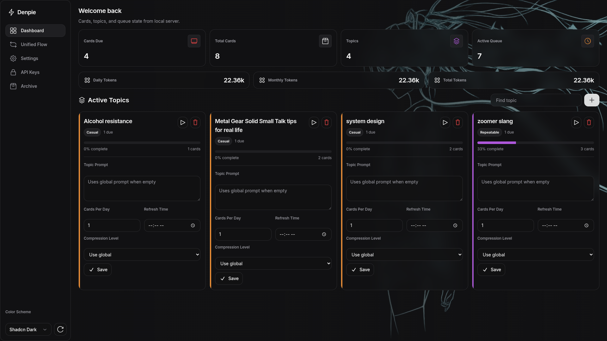
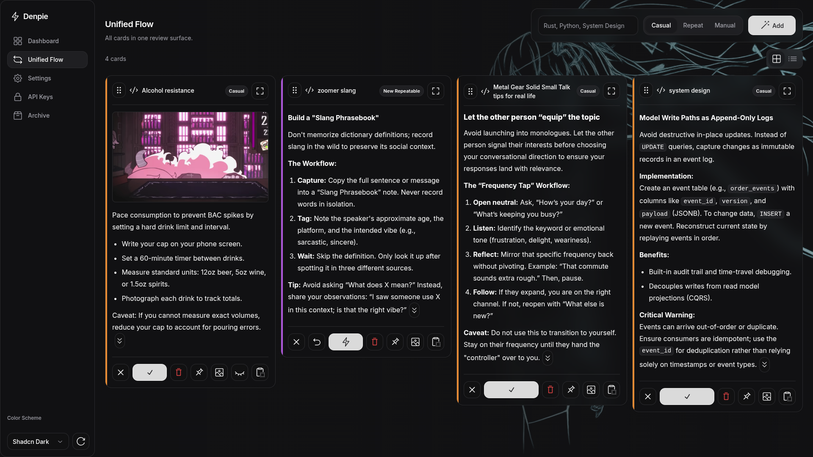
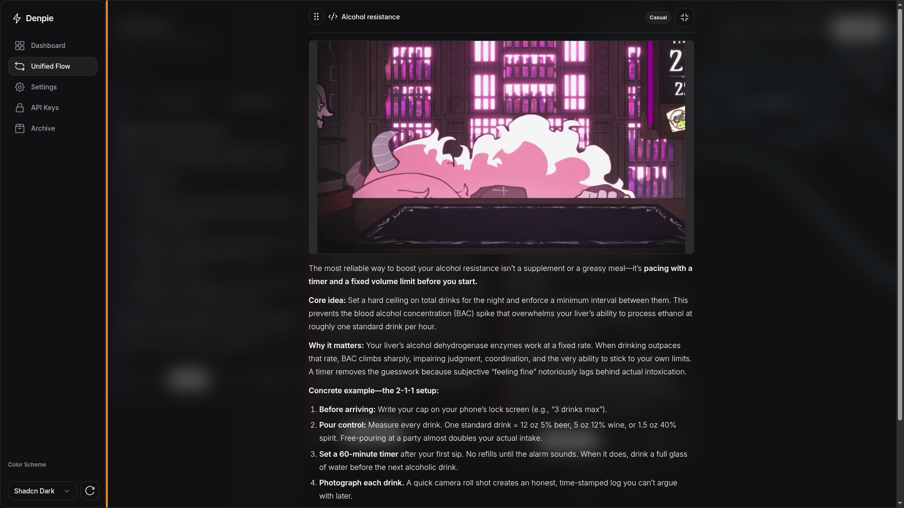

# Denpie

Daily tip cards with SM-2 review. Rust/Axum backend. Any OpenAI-compatible LLM.

## Run it now

```bash
just shell       # or nix-shell  (~30s first time)
just setup       # verify toolchain
just dev         # backend + frontend watchers
```

No Nix? Need Rust 1.95.0, `wasm32-unknown-unknown`, Trunk, `protoc`, SQLite. Pin is in `rust-toolchain.toml`.

### First boot (~2 min)

```bash
cargo run
```

Creates `denpie.db`, applies schema, builds frontend if needed, prints a one-time `admin_token`.

1. Open `http://127.0.0.1:3017/`
2. Create the first admin user with the printed token
3. Create an API key (UI) or `bootstrap_api_key` with that token
4. Set LLM model, API key, base URL, prompt (Settings UI or `update_settings`)
5. Put the key in `ApiRequest.auth` for every `POST /api` call

Backend-only hacking: `DENPIE_SKIP_FRONTEND_BUILD=1`.

## What it does

**Core**

1. SM-2 scheduling — grades, due windows, card types
2. Daily topic cards — per-topic refresh windows; Force Daily Refresh loads fresh cards
3. One public API — `POST /api` (protobuf); `/` is the browser app
4. Multi-user isolation — topics, cards, reviews, settings, keys
5. Tipcard images — browser compresses; server rejects >10 MB decoded, recompresses >800 KB

**Also**

- Manual cards (no LLM) and `custom_tip` cards (no review state)
- Topic icons (Iconify + HSL accent; fallback `lucide:tag`)
- Pinning + `max_active_cards` cap
- Token spend counters (daily / monthly / lifetime)
- Optional GitHub self-updates via systemd (off by default)

## Screenshots

| Grounding | Transmission | Fullscreen Card |
| :---: | :---: | :---: |
|  |  |  |

Transmission keeps pinned cards in a separate top section. Beneath it, topic picks show up to three cards per topic and nine cards total, reducing the per-topic allowance evenly when the total would exceed nine. All remaining due cards continue in an "Other cards" section below the picks.

## Dev commands

```bash
just quick            # fmt check + compile (default while editing)
just test-one <filter>  # targeted tests
just verify           # one full gate: fmt + clippy + tests
just agent-server     # isolated :3027 runtime, test login, smoke
just ui-check         # frontend release build + agent oneshot smoke
just ci               # verify + release frontend build
```

```bash
RUST_LOG=denpie=debug just backend
```

Grounding/image strategies log stage progress at `info`. LLM transport detail is at `debug`.

## Docs map

| Need | Open |
|---|---|
| `POST /api` reference | [`docs/protobuf-api.md`](docs/protobuf-api.md) |
| Agent ops cheat sheet | [`docs/agent-server-guide.md`](docs/agent-server-guide.md) |
| Where new code goes | [`docs/feature-integration.md`](docs/feature-integration.md) |

## Config

### Global — `settings.yaml` (generated, do not commit)

| Key | Default | What |
|---|---|---|
| `admin_token` | auto | First-user setup token |
| `autoupdate_enabled` | `false` | GitHub self-updates |
| `autoupdate_repo` | `slopfire/denpie` | `owner/repo` or URL |
| `autoupdate_branch` | `master` | Branch to watch |
| `autoupdate_check_interval_secs` | `3600` (min 60) | Poll interval |
| `autoupdate_command` | empty | Non-systemd update command |
| `autoupdate_last_seen_sha` | empty | Last seen remote SHA |

### Per-user (SQLite)

| Page | Owns |
|---|---|
| **Settings** | Default LLM, endpoints, credentials, prompt, reasoning/compression, appearance, schedule, `max_active_cards` |
| **Grounding** | Grounding-agent model/reasoning, fact grounding, Tavily or Firecrawl, image sources |

Empty grounding-agent fields inherit default LLM settings.

**Image modes:** No Images · Local Image Pool · Tag-based Image APIs · Isolated Image Search · Web Image Search.

The web provider can be Tavily (the default) or Firecrawl. Firecrawl powers factual web search,
image search, and link ingestion; linked web pages and supported remote documents such as PDFs are
scraped to clean Markdown through `/v2/scrape`. The base URL can target Firecrawl's hosted API or
a compatible self-hosted deployment.

Local Image Pool uploads accept PNG, JPEG, WebP, and GIF images up to 10 MB decoded. Denpie
recompresses larger uploads before sending them to the configured vision model for automatic
naming, description, and tags. An empty Vision Model setting inherits the default LLM model;
annotation failures retain the user-entered fallback name.

Generated cards request an image only when the model marks a visual as materially useful (for
example a diagram, physical identification, UI screenshot, or comparison). The decision and
specific query are stored with the card, including pending agentic-backlog cards; manual and
custom cards do not trigger automatic retrieval. `web_search` posts the query to the configured
provider and safely validates each returned image URL before storing it.
Isolated Image Search passes each enabled source's allowed image domains using the selected
provider's domain filter, then enforces that allowlist again before downloading a result.

### Card image append endpoint

`POST /app/tipcard-images/append` is session-authenticated and accepts
`{ "card_id": 1, "image_data": [], "pool_image_ids": [], "urls": [] }`. It appends up to
four card images total rather than replacing existing attachments. Data URLs and remote downloads
are limited to 10 MB decoded each; the JSON request limit is 56 MB. Pool images are copied into
card-owned storage. URL downloads allow only credential-free HTTP(S) targets, reject private and
local network addresses, validate every redirect, and cap redirects and response bytes.

- UI shows only providers for the selected mode.
- Providers start disabled — enable at least one.
- Denpie tries enabled providers in order until one returns a valid image.

Topic cards with an agentic backlog link to pending cards in the Archive.

### Self-updates

1. Set `autoupdate_enabled`
2. Helper rebuilds frontend + backend, installs, records SHA, restarts `denpie.service`
3. Status: `/admin/autoupdate/status`
4. Timeouts: network/restart 120s · build 1800s · install 300s

## Env vars

| Variable | Default |
|---|---|
| `DENPIE_BIND_ADDR` | `127.0.0.1:3017` |
| `DENPIE_RP_ORIGIN` | `http://localhost:3017` |
| `DENPIE_RP_ID` | from `DENPIE_RP_ORIGIN` |
| `DENPIE_RP_EXTRA_ORIGINS` | none |
| `DENPIE_PROD` | off (on for `https`) |
| `DENPIE_DATA_DIR` | current directory |
| `DENPIE_SCHEMA_PATH` | `./schema.sql` |
| `DENPIE_FRONTEND_DIST` | `./frontend/dist` |
| `DENPIE_STATIC_DIR` | `./static` |
| `DENPIE_IMAGE_DIR` | `$DENPIE_DATA_DIR/tipcard-images` |

## Deploy

### systemd (~1 min)

```bash
./install.sh
```

Installs binary, schema, frontend, static assets; creates `denpie` user; enables `denpie-autoupdate.timer`; restarts.

```bash
BIND_ADDR=127.0.0.1:3010 RP_ID=example.com RP_ORIGIN=https://example.com ./install.sh
```

Admin token after first start:

```bash
sudo journalctl -u denpie -n 100 --no-pager
```

### Docker

```bash
docker build -t denpie .
docker run -d --name denpie --network host \
  -e DENPIE_RP_ORIGIN=https://denpie.example.com \
  -e DENPIE_RP_ID=denpie.example.com \
  -v denpie-data:/var/lib/denpie \
  denpie
```

- Host ownership: `DENPIE_UID` / `DENPIE_GID`
- Reverse proxy: `DENPIE_BIND_ADDR=0.0.0.0:3017`

### DockerHub CI

Secrets: `DOCKERHUB_USERNAME`, `DOCKERHUB_TOKEN`, optional `DOCKERHUB_REPOSITORY`.  
Tags: branch, Git tag, `sha-<commit>`, `latest`.

## Layout

```
src/
  main.rs app.rs auth.rs error.rs types.rs
  api/          # protobuf handlers (thin)
  services/     # orchestration
  domain/       # pure rules — no SQL, no YAML
  db/repositories/
  dashboard/    # browser handlers
  llm/ scheduling/ autoupdate/ config/ tests/
proto/denpie.proto
schema.sql
frontend/       # Yew + Tailwind
settings.yaml   # local only — do not commit
```

## Tables

| Table | Holds |
|---|---|
| `api_keys` | SHA-256 hashed client keys |
| `users` | Profiles, roles, avatars |
| `topics` | Type, prompt, icon, color, daily overrides |
| `tipcards` | Content, title, pin state |
| `review_states` | SM-2 state, learning feedback, active/pending deck status, repeats, next review |
| `tipcard_images` | Attachment metadata |
| `user_documents` / `document_topics` | Grounding sources + topic links |
| `image_pool` | Local image pool entries |
| `llm_token_usage` | Per-call token totals |
| `user_settings` | LLM / UI / schedule |
| `daily_refresh_runs` | Processed topic windows |
| `passkeys` | WebAuthn credentials |

## Tests

```bash
just test
```

Integration tests use real servers on ephemeral ports and isolated temp settings. `just ci` also runs fmt, clippy, and a release frontend build.

## Stack

| Layer | Tech |
|---|---|
| Language | Rust 2024 |
| Web | Axum |
| DB | SQLite + SQLx |
| Runtime | Tokio |
| LLM | `async-openai` + shared `reqwest` |
| Wire format | Protobuf (`prost`) |
| Frontend | Yew/WASM + Tailwind v4 (shadcn token-port) |
| Public API | `POST /api` |

## License

MIT — [LICENSE](LICENSE).
